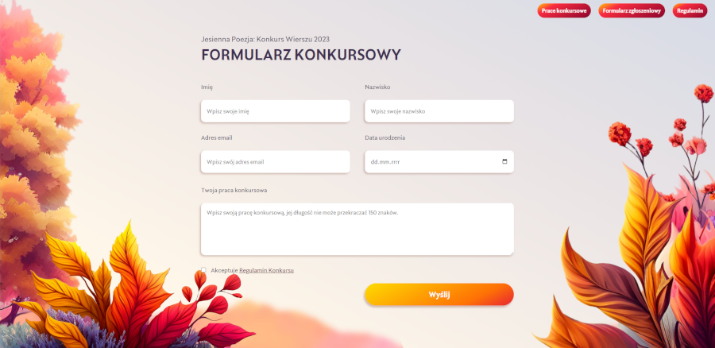
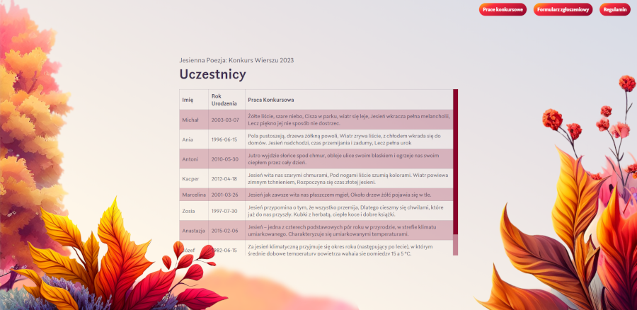
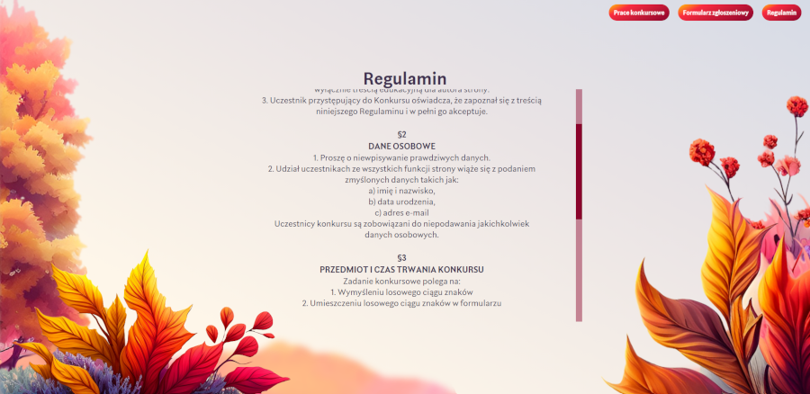

# Entry form for the poem competition "Jesienna Poezja: Konkurs Wierszu 2023" in PHP
The website includes an entry form for the literary competition. On the site you will find a form with validation, a sub-page with rules and regulations, and a sub-page with other users' competition entries.

### Getting Started
To get started, you will need to download and install XAMPP on your computer. You can download XAMPP from the official website: 
https://www.apachefriends.org/download.html

Once you have XAMPP installed, you can clone this repository to your htdocs folder in the XAMPP directory.
```
cd /path/to/xampp/htdocs
git clone https://github.com/yamishy/php-ecommerce-capstone.git
```
After cloning the repository, start the apache and sql servers using XAMPP and navigate to localhost/project/index.php in your web browser to see the website.

### Technologies Used
* PHP
* MySQL
* HTML
* CSS

### Screenshot's




